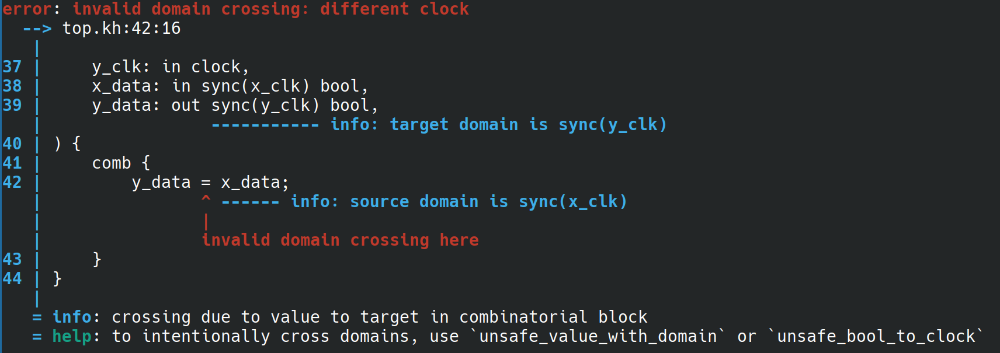

# HwLang

An experimental new language for hardware design.
A webdemo is available at https://karelpeeters.github.io/HwLang/.

A short sneak-peak at the language:

```
import std.types.[bool, int, uint, natural, any];

pub module top ports( 
    clk: in clock,
    rst: in async bool,

    sync(clk, rst) {
        data_to_add: in uint(0..8),
        stream_in: interface axi_stream(uint(0..8)).input,
        stream_out: interface axi_stream(uint(0..16)).output,
        values_transferred: out uint(32),
    }
) {
    comb {
        stream_in.ready = stream_out.ready;
        stream_out.valid = stream_in.valid;
        stream_out.data = stream_in.data + data_to_add;
    }

    reg out values_transferred = 0;
    clocked(clk, async rst) {
        if (stream_out.valid && stream_out.ready) {
            values_transferred = (values_transferred + 1) % 2**32;
        }
    }
}

interface axi_stream(T: type) {
    ready: bool, valid: bool, data: T,
    interface input { ready: out, valid: in, data: in }
    interface output { ready: in, valid: out, data: out }
}

```

## Background

Current Hardware Description Languages (SystemVerilog, VHDL) have some important weaknesses, some examples are listed in
more detail below. Many of those are difficult to fix without major changes and backward compatibility issues. Those
that can can be fixed suffer from the very long implementation cycle in EDA tooling: A new feature needs to be
supported by all the different tools that a project will use during its lifetime. This includes simulation, synthesis,
linting, power estimation, logical equivalence checking, and IDEs. These tools are implemented by different vendors that
don't share compiler frontends, and it takes years of time and many support requests to get more recent language
versions properly supported everywhere.

[//]: # (TODO make some remark about this leading to low productivity for HW dev compared to SW dev?)

This project takes a different approach: we implement a compiler that compiles a newly designed, modern HDL with the
important features we want, and compiles it to a lowest common denominator subset of Verilog. This effectively solves
decouples language development from tooling development. Improvements to the language, compiler and surrounding
infrastructure can be made without having to wait on all the different EDA vendors to follow. EDA vendors in turn can
focus on improving the core functionality of the tools instead of all doing the duplicate work of keeping up with
language version revisions.

## Language

### Core language

Some of the main ideas behind the language are listed here, where applicable with a comparison to the status-quo in
existing RTL languages, prefixed by _SV_ or _VHDL_.

[//]: # (TODO link to examples for each of these features)

* Strong type system
    * Tracks integer ranges and applies implications from if statements.
    * Support for arrays, struct, enums, tuples.
    * Values are strongly typed, every assignment is typechecked.
    * _SV_: Weak type system, values of any type are assignable to any other type, the bit widths don't even have to
      match. Integer overflow is also not checked without using extra linters.
    * _VHDL_: In some ways the type system is too strong (eg. arrays with the same length and inner type can't always be
      assigned to each other), in some ways it's too weak in that integer ranges are not checked and even types are not
      fully checked at compile-time, only at run- or synthesis time.

* Powerful generics
    * Can be values, types, functions, modules.
    * Can affect the presence or absence of ports.
    * Modules, structs, enums and interfaces can all be generic.
    * _SV_/_VHDL_: both are very slowly marking progress here, but their generics are comparatively very limited.

* Support for interfaces
    * Leads to code generation or lots of duplicate code
    * Makes instantiating and connection modules (one of the most basic and common things to do in RTL) much more
      convenient.
    * _SV_/_VHDL_: the latest versions have a limited form of interfaces, but vendor support is lacking. THis means that
      developers have to resort to writing lots of duplicate code, using editor templates or ad-hoc code generation
      tools. This makes instantiating and connecting modules with large interfaces cumbersome.

* Clock and reset domains are tracked by the compiler
    * Every port and signal is marked with its domain, and the compiler checks every assignment and connection to ensure
      that the
      domain crossing is valid.
    * Processes are always clearly marked as `clocked` or `combinatorial`, writing non-synthesizable constructs is not
      possible.
    * _SV_/_VHDL_: neither language checks domains, this is left to a separate linting or domain crossing checking step
      late in the development pipeline, instead of checked on every compilation.

* Registers, wires and temporary variables are all clearly defined as separate items with different keywords, reducing
  the risk of
  confusion.
    * This avoids accidentally creating registers, latches, or writing non-synthesizable constructs.
    * The compiler checks that all assignments are valid, for example registers can be only be set in a single clocked
      block.
    * The compiler also enforces that registers have reset values or that they have been explicitly marked as
      uninitialized.
    * _SV_/_VHDL_: the languages offer little support here. Modern _SV_ uses `logic` for registers, wires and temporary
      variables. _VHDL_ uses `signal` (which is a register or wire depending on the context) and `variable` (which is a
      register or temporary variable depending on the context). The status-quo solution to this is a combination of
      manual code review and linting, both of which have much more latency and overhead than a compiler check.

* Convenient variable declarations
    * Variables can be declared everywhere mixed together with other statements
    * Types can optionally be inferred
    * _SV_/_VHDL_ both have weird limitations on where variables can be declared

* Intuitive assignment semantics
    * There is only a single assignment operator, `=`, which always immediately assigns the value. THe following lines
      in the code always immediately observe the newly assigned value. It is the compiler's responsibility to correctly
      generate code that simulates and synthesizes correctly.
    * Both _SV_ and _VHDL_ have different assignment operators, blocking and non-blocking. The developer constantly has
      to be careful to use the right one, and reason correctly about the delayed assignment effects on non-blocking
      assignments. There seem to be a historic artifact of the early event-driven models of the languages, but there is
      no need to repeat this design mistake in a new language.

* Proper import and file scope system
    * The compiler parses all the source files in the project at once, and then resolves all imports between files as
      needed. This also completely eliminates any name collision issues.
    * There is a full module hierarchy, allowing code to be organized nicely.
  * Developers are free to choose th order of items in a file, the compiler does not simply read files top-down.
    * _SV_ doesn't have a library or import system at all, the user is responsible for compiling all files in the right
      order, and names always resolve to the last definition with a matching name.
    * _VHDL_ does a little better, allowing code to organized in libraries. This is still much weaker than a full module
      system through, and the user is till responsible for compiling all files in the right order.

### Modern compiler features

The expectations that software developers have for their tooling have risen significantly in the last decates.
Implementing a new compiler for an RTL language gives us the opportunity to implement some of these features
immediately.

* Modern error messages
    * If anything is wrong in the RTL, the compiler emits very clear error messages. EDA tools set the bar ver low here,
      we can do better.
  * 


* The compiler comes with a built-in [LSP](https://microsoft.github.io/language-server-protocol/) server. This allows
  different editors to get IDE-like features. Implementing this as part of the compiler means that there's no need to
  maintain a separate codebase for the LSP server, guaranteeing that the behavior matches that of the actual compiler.

[//]: # (TODO add autoformatter once it's merged)

* Care has been taken to optimize the compiler, for example it is fully multithreaded up to the level of individual
  file-level items and elaborated module. This means that even large projects should compile quickly.

### Interoperability

The goal of this project is not to immediately replace all existing RTL source code, interoperability with existing code
and workflows is very important.

#### Output Verilog

The output of the compiler is Verilog source code, which can be fed into any existing EDA tool and build flow.
We target Verilog 2005, using only a simple subset of language features. If we find that certain constructs are not well
supported by any EDA tool, we can change the Verilog code generation to fix it.

#### External modules

It's possible to declare _external modules_, which are modules with generics and ports but no body.
The compiler then assumes that given module already exists and is implemented in an external language.
These modules can be instantiated exactly like ordinary modules.
This makes it possible to use existing RTL source code and IP modules.

#### Python bindings

Users will always be able to come up with uses cases that the commandline compiler wrapper does not support.
To allow some more flexibility, the compiler can be imported as a library from Python, giving access to the compiler
library. This allows providing a set of source files to the compiler, and then elaborating certain modules or even
calling certain items from within python. Values are automatically converted to and from their Python equivalents.
This convenient bridge is very convenient during during verification and build flow development.

## Getting started

[//]: # (TODO)
TODO document:

* how to get compiler binaries
* how to set up the manifest for a project
* how to invoke the commandline compiler

## Repository structure

* Most of the compiler and surrounding infrastructure is is written in Rust. The workspace is at `rust/` and contains
  multiple crates:
    * The core `hwl_language` library crate contains the compiler implementation. The major sub-modules are:
        * `syntax`: Implements tokenization, parsing, formatting, resolving.
        * `front`: Contains the bulk of the implementation of the language:
          module elaboration, statement and expression evaluation, type checking, domain checking, ....
        * `mid`: the intermediate representation of elaborated and typechecked modules
        * `back`: different backends that consume the intermediate representation and generate the final useful output
            * _Verilog_: writes out synthesizable verilog source code
            * _Verilator_: wrapper around classes generated by [Verilator](https://www.veripool.org/verilator/)
            * _C++_: generates C++ that can be used to directly simulate the design, without having to use any EDA
              simulator.
    * The other crates use this core library and expose it in more convenient ways:
        * hwl_bin: commandline compiler and formatter
        * hwl_lsp_server: [LSP](https://microsoft.github.io/language-server-protocol/) server implementation
        * hwl_python: python module that uses PyO3 to provide python bindings to the compiler
        * hwm_wasm: wasm module that uses wasm_bindgen to provide web bindings
    * There's also the `hwl_util` crate that contains some common utilities.
* There's a VS Code plugin to act as the LSP client at `lsp_client/`, written in Typescript.
* The frontend of the webdemo is a NodeJS node project also using Typescript, located in `web_demo/`.

## Related projects

There are some projects that use general-purpose programming language as a host, and then allow developers to build the
hardware within that language. This has the major benefit of immediately making the features and ecosystem from the host
language available for parametrization and code reuse. The downside is that

* [Chisel](https://www.chisel-lang.org/): Uses Scala as a host language.
* [MyHDL](https://www.myhdl.org/): Uses Python as a host language.

There is also CIRCT which uses MLIR to define a common intermediate representation for hardware. This is similar (but
much more feature complete) than the one defined in this project, at some point it might make sense to switch to CIRCT
for better interoperability with other tools.

* [CIRCT](https://circt.llvm.org/): 
